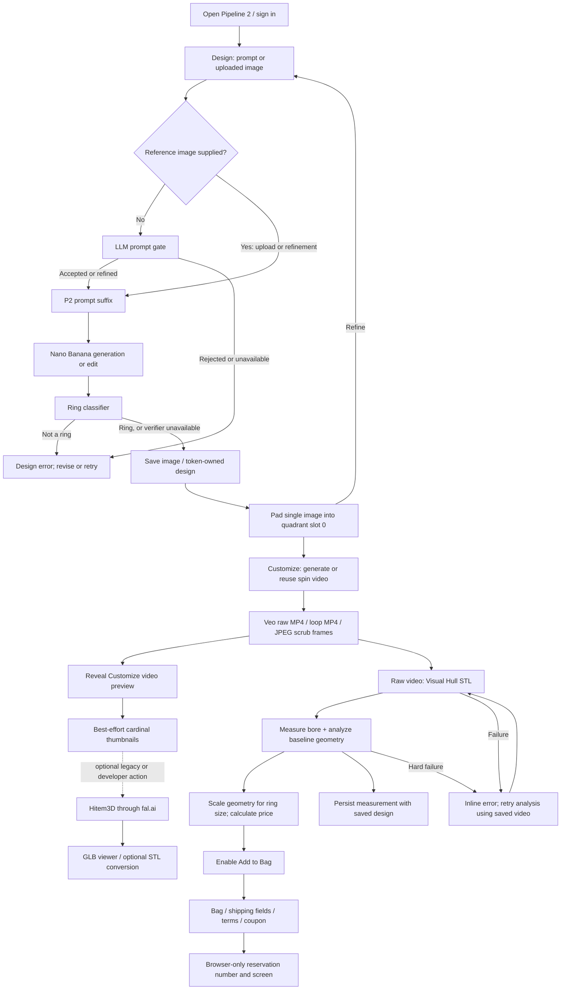

# Pipeline 2 — implemented flow and planning baseline

Reviewed: 2026-09-29. Repository: `C:\Users\yakir.tubul\Git\XjetJewelryBuilder`.
Source revision: `1e871734bb9ac0f824bdb8950d62fbf6a35083bb`.

This is a source-code trace, not a report of a successful live generation or production deployment. File references and line numbers refer to this revision. No application behavior was changed and no paid generations were submitted.

## 1. Purpose, scope, and evidence boundaries

Pipeline 2 is the ring-only XJet Atelier customer experience: describe or upload a design, generate/refine a single ring image, produce a spin-video preview, estimate size/weight/price from a Visual Hull, customize the selection, and reach a reservation screen. A separate Hitem3D branch can produce a downloadable mesh.

The actual customer path is **image → video → Customize preview, with Visual Hull → measurement → pricing in the background**. It is not a mandatory image → four views → Hitem3D → checkout sequence. `Pipeline2` is primarily a prompt/configuration and geometry utility class; the end-to-end orchestration is in the browser's `app()` object.

Evidence labels used here:

- **Confirmed:** directly visible in the checked-out application code.
- **Interface-confirmed:** application calls and arguments are visible, but the implementation of the called dependency is unavailable.
- **Risk/inference:** consequence suggested by the code; not reproduced by a runtime test.
- **Not established:** behavior cannot be demonstrated from this repository snapshot.

Important boundaries:

- `VisualHull/` contains only its `.git` pointer in this checkout. The parent pins submodule commit `9e9da07b0a21ababb3710f687026ef3ca213288c`; the local submodule has no resolvable HEAD. Its Python/C++ internals, model weights, and runtime accuracy could not be inspected. References below to its algorithms describe the application wrapper's contract and comments, not an independent audit of those algorithms.
- `Pipeline2.py` imports `ring_hybrid_cardinals` and `mp4_visual_hull` at module import time. This checkout cannot start the normal backend as-is without those sources (or an equivalent installed import path). The lazy classifier fallback does not solve these eager imports.
- No `app/llm_config.json`, `app/pipeline2-config.json`, or `app/ai-generation-config.json` was present. Image/video defaults are inspectable; the deployed gate model and live overrides are not. Prompt validation requires the gate configuration file.
- Existing untracked `RingRescaler/` was left untouched. The current integration resolves `VisualHull/Scripts/ring_rescaler`, not that root directory.
- README/older documentation and several comments describe earlier flows. Executable code takes precedence: for example, comments above `proceedToReview()` still say Customize waits for measurement, while its body reveals Customize immediately after the video stage.

## 2. High-level flow

The two mesh branches serve different purposes. Visual Hull supplies the main estimate; Hitem3D supplies an optional generated model. There is no confirmed step reconciling them or dispatching either mesh to manufacturing.

## 3. Detailed numbered user-to-output flow

1. **Entry and page boot.** `main.py:GetRootP2()` serves `index-p2.html` at `/p2/`; `GetJewelryB2C2()` serves the same page at `/JewelryB2C2/` when `SERVE_FRONTEND` is enabled. `/` is a separate launcher. The page loads Alpine.js, Tailwind, pricing scripts, `app-p2.js`, and a module chosen at the bottom of the template: normally `app-backend-p2.js`, or `app-backend-stub.js` for `?sim=1`.

2. **Access and registration.** `resetAIFlow()` requires a browser `userSession`, otherwise opens registration. Existing-token entry uses `/api/register-token`; email registration uses `/api/register`, then `/verify?token=...`. `token_store.py` stores pending registrations, verification expiry (24 hours), activation, and usage. `registration_mail.py` sends verification and access-token mail through `SendMailUtils.MailSender`. A `#token=...` studio link can establish the session. `init()` restores `xjet_session` and profile/draft data and refreshes quota. This UI access gate is stronger than several API gates: omitting `X-Token` is deliberately allowed by generation endpoints.

3. **Compose or upload.** `app-p2.js:processPrompt()` handles both creation and refinement. Source selection is: explicit upload first; otherwise prior `quadrantUrls[0]` if refining an existing design; otherwise text only. Fetching the prior reference can fail and fall back to text-only generation. Upload entry shows a rights-confirmation modal once per session. Empty text with an image becomes `Process this image`. `generateProductName()` is deterministic local naming, not an LLM call.

4. **Submit image job.** `api-client-p2.js:generateImage()` sends multipart `PromptText`, `Pipeline=2`, optional `ImageFile`, and optional `X-Token` to `/api/generate-image`. `_EnforceTokenQuota()` checks supplied tokens (401 invalid/inactive; 402 exhausted), but is a no-op without a token. Image requests check quota without incrementing usage.

5. **Gate and rewrite.** For text-only requests, `_RunPromptGate()` calls `ValidatePrompt()` → `CLlmClient.CompleteModel()` with `CPromptValidationResult`: `is_jewelry`, `is_feasible`, rejection reason, and refined prompt. Rejection returns 400; gate failure returns 503; an accepted refinement replaces the input. Image edits skip this gate. `P2.rewrite_prompt()` appends a single-view, upright-ring, white-background suffix. `SkipRewrite` can bypass that suffix at the shared endpoint; it does not bypass the text-only gate.

6. **Generate and verify image.** FastAPI schedules `RunFalImageTask()`; `TextToImage()` or `ImageToImage()` uses fal.ai Nano Banana Pro. `RunFalModel()` offloads `fal_client.subscribe()` to an executor. `SaveImageLocally()` downloads the output under `app/static/models/`. `VerifyRingImage()` then calls a lazy ONNX classifier wrapper: a negative verdict fails the job with `not_a_ring`; a missing/broken verifier logs a warning and allows generation to complete. This verification runs for both generation and edits, and is shared with Pipeline 1.

7. **Persist/display the image.** Successful token-attributed generation calls `ProjectStore.CreateDesign()` with image job ID as design ID. A root-level `image-job-{id}.json` records provider output and metadata. The browser polls, captures `currentDesignId=result.job_id`, updates `activeModel`, and adds an in-session My Designs entry. The P2 backend adapter overrides the misleadingly named `window.splitQuadrants()` to call `/api/pad-image`: it returns `[paddedUrl, null, null, null]`, not four crops. `Pipeline2.pad_image()` fits the whole image onto a white 1024×1024 default canvas. Refinement creates a new image/design job rather than a revision linked to its parent.

8. **Customize starts/reuses video.** `proceedToReview()` navigates to `review`, guards re-entry, and shows the spin loader. A real saved `scrubVideoStem` skips video generation; otherwise it uses slot 0, rebuilding the pad from the saved image if necessary. `generateVideoWorkflow()` posts the image plus `DesignId` and token to `/api/generate-video`. The server uses P2 spin settings even though this endpoint is shared and receives no pipeline selector.

9. **Video preparation and generation.** `RunFalVideoTask()` → `ImageToVideo()` performs a second, distinct padding operation: `PadImageToVeoCanvas()` normalizes the white background, adds a white border, and fits the input within 60% of a 1280×720 canvas. It uploads this input and calls Veo. It saves the raw MP4, attempts a 0.4-second seamless loop crossfade, and falls back to the raw clip if loop processing fails. `ExtractVideoFrames()` produces 960×540 JPEG frames and `meta.json`; frame-extraction failure is logged without failing the generated video.

10. **Attach video and account for usage.** `AttachVideo(DesignId, Token, FramesStem)` is owner-scoped. Success increments the token's usage once for the video and writes `video-job-{id}.json`. The browser updates its counter and reconciles with `/api/token-status`. Usage is not a charge for each image/refinement. Simulation exits early without these normal persistence/accounting operations.

11. **Reveal Customize before analysis finishes.** The executable body of `proceedToReview()` hides the full-screen loader as soon as the video workflow returns. It launches `_runVisualHullPipeline()` and `_loadQuadrantThumbnails()` without awaiting them. The screen shows the spin preview while price reads “Refining estimate…” and Add to Bag remains disabled. The video job itself attempts JPEG extraction before completion, so “video ready” still includes that preprocessing wait.

12. **Interactive preview.** `initVideoScrubber()` reads `/api/video-frames/{stem}`. A missing frame cache starts extraction and returns 202; the browser retries up to 40 times at three-second intervals. It loads JPEGs concurrently and reveals the canvas after the first frame loads. Drag/scrub, zoom, pan, and metal tinting operate on rendered frames. This is a video-frame viewer, not the Hitem3D mesh viewer. `scrubDrawFrame()` and related tint functions alter appearance without regenerating geometry.

13. **Extract four cardinal views, best effort.** `_loadQuadrantThumbnails()` calls `extractQuadrantsOrdered()` → GET `/api/extract-quadrants`. `Pipeline2.extract_quadrants()` extracts aligned working/native frame sets, calls `AnalyzeFrames()`, and exports found `0/90/180/270` images. It accepts at least two views; it does not guarantee four or a front view. Browser order is `[0,180,90,270]` → `[front,back,right,left]`; missing views become null. The detector is interface-confirmed only. Main pricing does not consume these thumbnails. The thumbnail request receives the scrubber stem, potentially `_loop`; the hull branch explicitly strips that suffix.

14. **Reconstruct Visual Hull.** `_runVisualHullPipeline()` removes `_loop`, checks `_pipelineCache[baseStem]`, then sends HEAD for the predictable hull STL before submitting `/api/visual-hull`. `RunVisualHullTask()` is a synchronous BackgroundTask, executed in the thread pool. `Pipeline2.run_visual_hull()` runs `VisualHull/Scripts/mp4_visual_hull.py --output ... --pixel-size 0.1 <raw.mp4>`, with a 480-second subprocess timeout. Its contract describes silhouette reconstruction through `visual_hull_mv`; internal implementation is unavailable here. Existing output files are reused by existence alone.

15. **Measure the ring.** The UI calls `/api/p2-ring-rescale` with `measure_only=true`. `RunRingRescaleTask()` → `Pipeline2.run_ring_rescale()` loads the mesh through `ring_rescaler.mesh_io.LoadMesh(Fast=True)`. It looks for the matching raw MP4 and uses `_measure_bore_from_video()` to obtain a cardinal-anchored bore/finger diameter in pixels. The wrapper computes `mm_per_px = max(mesh.extents) / face_on_outer_px`, then `inner_diameter_mm = finger_px * mm_per_px`. It is not a simple multiply by hull pixel size. If video measurement fails or finds no bore, it calls mesh `FindHoleAxis`, `Rasterize(...,1024)`, `MeasureHole`, and `CheckRing`. No hole in this fallback raises `error_code=open_ring`. Algorithm internals are interface-confirmed.

16. **Analyze baseline and estimate price.** The browser requests `/api/analyze-part` on the hull, initially with Sterling Silver 925. `_AnalyzeGeometryTrimesh()` returns bounds, volume, and surface area; `_RunCPPCalc()` also returns cost/price and four feasibility heuristics. The UI retains baseline dimensions and volume, persists measurement, and recalculates with the currently selected metal and US size. With `sf = target_diameter / measured_diameter`, dimensions scale by `sf` and volume by `sf³`. `xjet-calc.js:calculatePart()` computes manufacturing cost and weight; `costToPrice()` applies `cost / (1 - margin)` from `metal-map.js`. UI prices are rounded to whole dollars. Main size changes rescale numbers only: they do not call the rescale endpoint to save a new STL.

17. **Customize and add to bag.** The UI offers stainless steel, sterling silver, 14K vermeil, and yellow/rose 10K/14K/18K gold. It stores finish, size, quantity, and per-piece sizes. Metal/size watchers recalculate measured pricing. `analysisReady` permits a measured diameter or the special `open_ring` fallback, provided no running/hard-failed analysis exists. `addToBag()` checks that predicate and snapshots lines from `_buildCurrentLines()`. Mixed sizes are grouped into lines but use the same current base unit price; no per-line size recalculation occurs.

18. **Checkout stops at local reservation.** `goToCheckout()` opens `checkout`, `bagStep=bag`, and prefills profile data. The payment step collects shipping/contact fields. `placeOrder()` checks required fields and terms, accepts only coupon `XJET10` as the payment placeholder, creates random `XJ` + six-digit `orderNumber`, and sets `bagStep=reservation`. There is no fetch, order database write, payment capture, order email, manufacturing job, or admin-order handoff in this function. The cart, shipping form, and reservation number exist in browser memory. The active cart total uses tax rate zero, free standard shipping, or $45 express; an older `orderTotal` getter with $25 shipping belongs to a separate legacy calculation.

19. **Optional Hitem3D/model output.** The developer shortcut Shift-F4 / `triggerHitem3D()`, legacy configuration/generate-3d controls, or `proceedFromDetails()` can invoke `generateHitem3D()`. These are separate from the normal Customize button. The browser posts labelled static image URLs and `DesignId`; the server starts `RunHitem3DTask()` in a daemon thread. It requires a front image, uploads valid views to fal.ai, selects single-image hi3d for front only or multi-view hi3d otherwise, downloads the model, and calls `AttachModel()`. The browser opens `3d-viewer` through `window.init3DScene()` in `app-backend.js`. `downloadModelAs('stl')` uses `/api/convert-to-stl`; trimesh exports the loaded scene/mesh. Conversion does not rescale to the selected ring size or perform an explicit manufacturing-repair step.

20. **Reopen a design.** `/api/my-designs` loads token-owned records. `loadProject()` restores image, optional Hitem3D URL, video stem, and parsed measurement. Saved measurement seeds `_pipelineCache`, making Customize's analysis path an immediate cache hit. Designs with an image but no saved video rebuild padding and generate video once. Favorite/delete calls are owner-scoped; deleting a database row does not delete its generated assets.

## 4. Frontend, backend, and API map

Paths below are relative to the repository. Function names are the stable lookup keys; line numbers are navigation aids.

| User stage | Frontend source | API / backend source |
|---|---|---|
| Boot and screens | `app/templates/index-p2.html:947` Design, `:1449` Customize, `:2611` checkout; `app/static/js/app-p2.js:19` `app()` | `app/main.py:205` `GetRootP2`, `:217` `GetJewelryB2C2` |
| P2 adaptation | `app/static/js/app-backend-p2.js` imports shared backend then replaces image/padding workflows | `Pipeline2` in `app/Pipeline2.py:74`; `PipelineBase` interface at `app/PipelineBase.py:984` |
| Registration | `submitEmailRegistration`, token registration and fragment login in `app-p2.js` | POST `/api/register`, POST `/api/register-token`, GET `/verify`, GET `/api/token-status`; `main.py:992–1132`, `token_store.py`, `registration_mail.py` |
| Image/refinement | `processPrompt`; `api-client-p2.js:25,140` | POST `/api/generate-image`; `main.py:486`, `PipelineBase.py:522` `RunFalImageTask`, `:413` `TextToImage`, `:423` `ImageToImage` |
| Validation | gate banner/error classes in shared `api-client.js` | `_RunPromptGate` `main.py:430`; `prompt_gate.py:CPromptValidationResult/ValidatePrompt`; `llm_client.py:CLlmClient`; `ring_verify.py:VerifyRingImage` |
| Ring check/debug padding | P2 adapter `splitQuadrants` → `padImage` | GET `/api/verify-ring`, POST `/api/pad-image`; `main.py:625,638`; `Pipeline2.py:375,399` |
| Video | `proceedToReview` `app-p2.js:1645`; shared `generateVideoWorkflow` | POST `/api/generate-video`; `main.py:567`; `PipelineBase.py:486,621` |
| Scrubber | `initVideoScrubber`, `scrubDrawFrame`, drag/zoom handlers | GET `/api/video-frames/{VideoStem}`; `main.py:598`; `PipelineBase.py:205` `ExtractVideoFrames` |
| Cardinal thumbnails | `_loadQuadrantThumbnails` `app-p2.js:1775`; `extractQuadrantsOrdered` | GET `/api/extract-quadrants`; `main.py:651`; `Pipeline2.py:431` `extract_quadrants` |
| Hull analysis | `_runVisualHullPipeline` `app-p2.js:1813`; `generateVisualHullWorkflow` | POST `/api/visual-hull` (stem or uploaded video); `main.py:737,675`; `Pipeline2.py:575` `run_visual_hull` |
| Measurement/rescale | `ringRescaleWorkflow` `api-client-p2.js:126`; primary UI uses measure-only | POST `/api/p2-ring-rescale`; `main.py:716,693`; `Pipeline2.py:619,789` |
| Price | `_recalculatePriceFromMeasurement`, generic `runCalculation`; `xjet-calc.js`, `metal-map.js`, `cpp-overrides.js`, vendored `constants.js` | GET `/api/analyze-part`; `main.py:874`; `PipelineBase.py:899,911` |
| Hitem3D | `triggerHitem3D`, `generateHitem3D`; `app-backend.js:init3DScene` | POST `/api/hitem3d-generate`; `main.py:820` `CHitem3DRequest`, `:833`; `PipelineBase.py:725` `RunHitem3DTask` |
| Download | `downloadModelAs` | GET `/api/convert-to-stl?glb_path=...`; `main.py:858` `convert_to_stl` |
| Shared jobs | `api-client.js:167` `pollJobStatus`; Hitem3D has its own loop | GET `/api/job-status/{JobId}`; `main.py:963`; `PipelineBase.py:jobs` |
| Saved designs | `loadMyDesigns`, `loadProject`, `_persistDesignMeasurement`, favorite/delete | GET `/api/my-designs`; DELETE `/{design_id}`; PATCH `/{design_id}/favorite` and `/measurement`; `main.py:1145–1187`; `project_store.py` |
| Bag/reservation | `addToBag`, `_buildCurrentLines`, `placeOrder` `app-p2.js:1601` | No order/payment endpoint |

Other existing routes must not be mistaken for the primary P2 path: `/api/split-quadrants` crops a Pipeline 1 four-pane image; `/api/generate-3d` uses SAM-3 and P1 rewriting; `TextTo3d()` contains a Meshy helper without a primary P2 caller. The standalone `app/hitem3d_cli/` uses the older direct Hitem3D API; the application's current task uses fal.ai instead.

### Admin and operations integration

- `RequireAdmin()` uses HTTP Basic username `admin` and `app/admin-key.priv`. `/admin/`, `/admin/stats`, `/admin/logs`, `/admin/tokens`, `/admin/tokens/{TokenCode}`, and `/admin/ai-config` use it.
- Token administration creates/activates/deactivates/edits/deletes access tokens and resets usage. `GetStats()` and `_ScanJobFiles()` drive statistics and generation history; they do not represent orders or fulfillment.
- `/api/config/ai-generation` and section update/reset handlers protect Nano Banana configuration with admin auth. `/api/config/pipeline2` GET/POST lacks `RequireAdmin` in application code, despite being used by configuration/admin screens.
- `/debug/pipeline2/{page}` serves stage tools for text-to-image, image-edit, verify-ring, pad-image, image-to-video, extract-quadrants, Visual Hull, ring-rescaler, Hitem3D, and config. Asset pickers and `/api/asset-history` support investigation. No app-level admin dependency is attached to these debug routes.
- `app/logger.py`, request middleware, and root job JSON files support troubleshooting. Hull and measurement jobs use memory status and logs, not the same durable `*-job-*.json` history written by AI tasks.
- `nginx-install.sh` describes `/JewelryB2C2/` proxying to backend `/p2/`, plus API/admin/static routing. This is deployment configuration evidence, not proof of the live server setup.
- `SyncYakirB2C.py` is source-file synchronization with adjacent `JewelryB2CWebsite`, not an order-processing connector. No ERP, slicer dispatch, manufacturing queue, payment webhook, or order-processing integration was found in the P2 code path. Tracking/summary markup is not evidence of a backend integration.

## 5. State, data objects, persistence, and artifacts

| Layer | Objects / location | Lifetime and semantics |
|---|---|---|
| Browser reactive state | `view`, `step`, `activeModel`, `generatedImageUrl`, `currentDesignId`, `quadrantUrls`, `scrubVideoStem`, `hitem3dModelUrl` | Single Alpine application; globals on `window` connect adapters/viewer/calculator |
| Analysis state | `visualHullStlUrl`, `ringMeasuredDiameter`, `ringBaselineGeo`, errors/running flags; `_pipelineCache[baseStem]={stlUrl,diameter,geo}` | In-memory cache; populated from persisted measurement when opening saved designs |
| Local storage | `xjet_session`, `xjet_profile`, `xjet_design_draft` | Session/token/quota and profile; draft contains prompt/reference image, current image, quadrants, material/size, chat, product metadata; draft expiry seven days, save debounce 600 ms |
| Cart/order | `cart[]`, `checkoutForm`, `bagStep`, `orderNumber` | Browser memory only; line fields include image, name, metal, finish, size, qty, price; no durable design ID/model/STL linkage in `_buildCurrentLines()` |
| Live job registry | `PipelineBase.jobs` | Process-local dictionary; jobs return `status`, `result`, sometimes `logs`; no durable queue, scheduler, cancellation, replay, or cross-worker coordination |
| Designs DB | `app/designs.db`, table `designs` | `id`, `token`, `name`, `prompt`, `image_url`, `model_url`, `video_stem`, `status`, `is_favorite`, timestamps; migrated `measurement` JSON column |
| Design status | `image_ready` then `model_ready` on `AttachModel` | Attaching video/measurement does not turn this into a full pipeline state machine |
| Measurement JSON | `{stl_url, diameter_mm, geo:{x_mm,y_mm,z_mm,volume_cm3}}` | Sent by client PATCH; no model/config/version hash; positivity/completeness checks are limited |
| Tokens DB | `app/tokens.db`, table `tokens` | token, identity, generations used/max, active state, source, verification data and timestamps |
| Provider/job records | root `image-job-*.json`, `video-job-*.json`, `model-job-*.json`, `hitem3d-job-*.json`, `{JobId}-Result.json` | Filesystem records for history/debug; do not restore `jobs` after restart |
| Config | `app/pipeline2-config.json`, `app/ai-generation-config.json`, `app/llm_config.json` | Runtime overrides/required gate configuration; absent in inspected checkout |

Artifact family under `app/static/models/`:

- `generated_image_{id}.{ext}` (PNG under current image defaults; save helper derives the extension from the provider URL/data URI), optional image input, and independently generated `padded_{uuid}.png`.
- `generated_video_{id}_input.png`, `generated_video_{id}.mp4`, optional `generated_video_{id}_loop.mp4`.
- `{videoStem}_frames/frame_0001.jpg...` plus `meta.json` for scrubbing.
- `{videoStem}_cardinals/{0,90,180,270}.png` for found views, plus `result.json` cache. Export URLs carry file-mtime query strings; reruns prune old missing views.
- `{baseStem}_visual_hull.stl` for estimate geometry.
- `{meshStem}_rescaled_{diameter}mm.stl` only when the rescale API is explicitly called with `measure_only=false`; not produced by normal Customize size selection.
- `hitem3d_{jobId}.glb` by default, plus sibling `.stl` on conversion; SAM-3 uses its own `generated_{id}.glb` family.

Persistence caveats confirmed by the call graph: image results can be marked completed before design insertion finishes; video completion is set before quota increment/job-file write. A later exception can overwrite status to failed after assets exist. `AttachVideo`/measurement errors may be tolerated, leaving a visible result without its saved association. The draft does not save `currentDesignId` or video/measurement state; restoring a draft is different from loading a saved database design. `BackfillVideoStems()` and `scripts/backfill_design_videos.py` provide a historical video-link recovery utility.

## 6. External services, models, and parameters

These are code defaults, not verified production settings or provider guarantees.

| Stage | Integration | Confirmed defaults / contract |
|---|---|---|
| Prompt gate | `CLlmClient` → configurable fal endpoint/model | Endpoint/model required from `llm_config.json`; module describes `fal-ai/any-llm`; no concrete deployed model verified. Structured Pydantic verdict; no application retry loop |
| Image | `fal-ai/nano-banana-pro` | `aspect_ratio=1:1`, `resolution=1K`, `output_format=png`, `limit_generations=true`; sidecar `nano_banana_gen_system_prompt.txt` plus appended P2 prompt suffix |
| Image edit | `fal-ai/nano-banana-pro/edit` | Same default parameters, `image_urls=[uploaded_reference]`, `nano_banana_edit_system_prompt.txt` |
| Ring verification | VisualHull `ring_classifier.CRingClassifier` | Wrapper describes DINOv2 ViT-S/14 + two-class ONNX CPU model; threshold 0.5; singleton; dependency unavailable here |
| Video | `fal-ai/veo3.1/fast/image-to-video` | `duration=8s`, `aspect_ratio=16:9`, `resolution=720p`, `generate_audio=false`, `safety_tolerance="4"`; optional seed; positive and negative prompts configurable |
| Spin instructions | `Pipeline2.DEFAULT_SPIN_VIDEO_PROMPT` | Requests rigid object, locked camera, white background, exactly 720° over 8 seconds, 90°/second; this is a prompt, not a verified physical/temporal constraint |
| Cardinal extraction | `ring_hybrid_cardinals.AnalyzeFrames`, `mp4_visual_hull.ExtractFrames` | `white_v=205`, `white_s=40`, `work_size=420`; working width at least 768; native frames used for spin/export when index-aligned; optional fps/front frame/force |
| Hull | local Python + expected `visual_hull_mv` binary and ffmpeg | `pixel_size=0.1`; timeout 480 seconds; actual geometry algorithm/binary build unavailable |
| Bore | `ring_diameter`, `ring_rescaler` | Wrapper uses `v_bg=230`, `s_bg=30`, `s_shadow=20`, `shadow_rejection=auto`; cardinal-anchored measurement; mesh fallback raster resolution 1024 |
| Hitem3D | `hitem3d/hi3d/v3.0/image-to-3d` or `/multi-view-to-3d` | `model=hi3dv3.0`, `resolution=2048quality`, `face_count=2000000`, GLB (`Format=2`), texture/PBR false; accepted names front/back/left/right |
| Cost estimation | vendored XjetCostPerPartCalculator constants + overrides | Local Python/browser implementations; dimensions, volume, material density/ink price, yield, process/tray/labor/equipment inputs; no external quote service |
| Registration mail | SMTP via `MailSender` | Environment-configurable relay/sender; verification and access-token mail only |

Hitem output codes are `1=obj, 2=glb, 3=stl, 4=fbx, 5=usdz`. Legacy resolutions 512/1024/1536 map to `2048quality`, 1536pro to `2048master`. The viewer normally expects GLB even though the endpoint accepts other formats.

`AI_CONFIG` controls image prompts/parameters at call time; image model IDs remain hardcoded. P2 config controls suffix, video settings, padding, extraction, and gate overrides, resetting the shared cached gate client. Changing these settings does not invalidate existing asset/measurement caches. Credential contents were not read for this review.

## 7. Failure and retry paths

| Failure | Actual behavior / recovery |
|---|---|
| Invalid/exhausted supplied token | Generation returns 401/402; UI refreshes quota; missing token bypasses quota check |
| Gate rejection / gate unavailable | 400 structured `prompt_rejected` / 503 `gate_unavailable`; image API client maps to `CPromptGateError`; UI shows explanation and restores suggested/original text |
| Provider error | `_ClassifyFalError()` recognizes billing and content-policy messages; otherwise uses exception text; job becomes failed. No application-level automatic generation resubmission |
| Generated non-ring / verifier failure | Non-ring: `not_a_ring` failure. Verifier infrastructure exception: warning and fail-open behavior |
| Transient status polling | Shared poller retries same job every two seconds for network errors and HTTP 408/425/429/500/502/503/504; tolerates 10 consecutive transient failures and fails on the next; success resets counter |
| Poll deadline | Image 300 s, video and SAM-3 600 s, hull 600 s, measurement 120 s. No AbortController per-fetch deadline; overall limit is checked between requests and does not cancel server work |
| Backend restart / unknown job | `/api/job-status` returns failed with `job_lost`; job JSON files do not rehydrate live jobs |
| Video generation failure | Full-screen loader error; `retryAnalysis()` re-enters `proceedToReview()`, reusing a saved video if available |
| Loop/frame preprocessing failure | Loop falls back to raw; frame extraction logs warning, can retry on demand through frames endpoint |
| Cardinal failure | API returns 404/500; `extractQuadrantsOrdered()` catches and returns null, preserving placeholders; fewer than two cardinals is a server error |
| Hull timeout | `subprocess.run(timeout=480)` stops the immediate child, deletes partial STL, reports failed; descendant process-tree termination is not explicitly managed |
| Other hull failure | Background task records error; general subprocess failures do not have the same explicit partial-STL cleanup as timeout |
| Measurement failure | Video method falls back to mesh. Missing fallback hole returns `open_ring`, treated as soft success by `analysisReady`; other failures block bag and show inline retry |
| Inline analysis retry | `retryAnalysis3D()` clears error/diameter state and reruns analysis using existing video/STL/cache; does not regenerate video or cover preview with loader |
| Cancel/back | `cancelAnalysis()` changes UI/navigation; no server cancellation endpoint |
| Hitem3D | Requires front image; errors alert user. Its live browser poll loop uses three-second polling with no overall deadline or shared transient retry handling |
| Measurement persistence | Client PATCH is best effort; failure logs warning and means future remeasurement may be necessary |
| Checkout validation | Missing fields/terms or incorrect coupon leaves user in checkout with a message; no payment retry/webhook path exists |

Simulation has two distinct controls: template `?sim=1` selects frontend stubs; backend `PipelineBase.Simulation` is a code-level flag and Hitem requests also have `Sim`. Stub/sample results must not be used as evidence of working production generation or fulfillment.

## 8. Current bottlenecks and risks

These observations describe current code; they are not changes made by this document.

1. **Missing runtime prerequisites (confirmed locally).** VisualHull sources are unavailable and gate config is absent. This prevents full local startup/generation verification. Model quality, binary behavior, and deployed overrides remain unverified.
2. **No durable orchestration (confirmed; scaling risk inferred).** Browser code drives stages; jobs are per-process memory; Hitem threads are daemon threads. Restart loses polling state, multiple workers can see different registries, and leaving the page can prevent later stages from being scheduled. There is no idempotency key, shared work queue, cancellation, or per-stage resume record.
3. **CPU/event-loop contention (code-supported risk).** Hull/measurement tasks are correctly synchronous background tasks, but `/api/extract-quadrants` directly calls CPU/subprocess work inside an async route. `_RunPromptGate()` also makes a synchronous provider call from the async image endpoint; loop creation and some uploads are synchronous inside async tasks. The browser fires cardinal extraction alongside hull work, so “best effort” frontend scheduling does not guarantee backend isolation.
4. **Preview versus manufacturable geometry (confirmed separation; quality risk inferred).** Video appearance, hull estimate mesh, and optional hi3d mesh can differ. A prompt requesting rigid 720° rotation cannot guarantee it. There is no reconciliation, final-sized production artifact, mesh approval, or fulfillment linkage in normal checkout.
5. **Pricing readiness is weaker than a validated quote (confirmed).** `analysisReady` accepts any non-null measured diameter or `open_ring`; it does not require positive computed price, baseline geometry, or passed feasibility rules. Open-ring fallback can unlock a catalog/previous estimate without measured geometry. The backend accepts client-supplied measurement data; it is not an authoritative signed quote.
6. **Sizing/volume assumptions (confirmed formulas; accuracy unverified).** Bore scale uses largest mesh extent against face-on image extent, which may include ornamentation. `_AnalyzeGeometryTrimesh()` guesses metres if largest extent is under 1, otherwise millimetres, and takes absolute signed volume without a watertightness gate. The feasibility “Min Feature Size” test uses minimum overall bounding dimension, not measured wall thickness. These are estimates, not manufacturing certification.
7. **Price-model divergence (confirmed implementations; parity untested).** Python and JavaScript duplicate the CPP calculation; Python hardcodes tray dimensions where browser uses tray constants. 10K is estimated from 14K; vermeil plating is explicitly not costed. Finish is stored but not passed into `calculatePart`. Mixed-size cart lines all inherit the current base price rather than their own scaled price.
8. **Cache validity and concurrent work (confirmed keys; stale-result risk inferred).** Hull cache is filename existence, measurement cache is video stem, and saved measurement carries no config/version fingerprint. Cardinal cache default detection uses fixed parameter values. There is no hull per-stem lock or atomic output publication; duplicate requests can target the same file. A partial file after a non-timeout failure can be reused.
9. **Cross-design asynchronous state risk (inferred).** Thumbnail, hull, and persistence work mutate the same Alpine object without a request-generation identity check. Switching/refining designs during pending work can apply an old result to current state. `processPrompt()` catches padding failure without clearing prior quadrants first, so an old reference can survive that failure.
10. **Persistence gaps (confirmed).** P2 `generateImageWorkflow()` accepts only four arguments although `processPrompt()` passes a fifth product name; `generateImage()` does not submit `DesignName`. DB naming therefore falls back to rewritten prompt prefix, while browser uses its chosen name. The draft omits design ID/video/measurement. Cart lines omit durable design/mesh IDs, and reservations are not stored.
11. **Access-control boundaries (confirmed in app code; deployment exposure unverified).** Anonymous generation is supported; Hitem does not call `_EnforceTokenQuota`; `AttachModel()` updates by design ID without token ownership. P2 configuration, asset listings/history, geometry tools, and static assets lack the same authentication as admin/design CRUD. Several file endpoints check `/static/` prefix without resolving and verifying containment. These need explicit decisions before a public production pipeline, irrespective of possible proxy restrictions.
12. **Storage/observability gaps (confirmed).** Design deletion leaves files; generated videos/frame collections can accumulate; no asset cleanup lifecycle is implemented here. Provider logs/root result files do not form a complete stage audit. Hitem's polling behavior differs from the more resilient shared poller.
13. **Checkout/operations gap (confirmed).** Reservation UI is not an order record. There is no confirmed email, payment, admin approval, job ticket, or manufacturing handoff; production-sounding screen copy should not be taken as an implemented integration.

## 9. Extension points for a future pipeline

These are existing seams to evaluate, not a redesign of Pipeline 2:

- **Prompt policy:** `PipelineBase.rewrite_prompt()` / `Pipeline2.rewrite_prompt()`, `ValidatePrompt`, sidecar prompts, and configuration stores. Note that route selection currently recognizes only `Pipeline == "2"`, otherwise P1; a new class alone does not register a new pipeline.
- **Generation adapters:** `TextToImage`, `ImageToImage`, `ImageToVideo`, `RunFalModel`, and `RunHitem3DTask` isolate most provider payload construction, though Hitem has a separate runner.
- **Geometry stages:** `run_visual_hull`, `run_ring_rescale`, `_measure_bore_from_video`, `_AnalyzeGeometryTrimesh`; define the current places where an alternative reconstruction/measurement method could connect.
- **Frontend bridge:** `app-backend-p2.js` demonstrates overriding workflow functions while sharing viewer/API modules. `app-p2.js` still contains most orchestration and state coupling.
- **Asset presentation:** frame scrubber and Three.js `init3DScene` are distinct preview choices. Keep their artifact contracts explicit when planning.
- **Data ownership:** `project_store.py` and token-scoped design endpoints provide saved-design primitives, but have no pipeline version, parent revision, durable stage graph, order schema, or artifact lineage.
- **Pricing:** shared constants/metal map and `calculatePart`/`_RunCPPCalc` are available calculation boundaries. A future quote contract must decide which geometry, units, and version it trusts.
- **Operations:** admin/token/config/history screens and debug stage pages can expose additional stages. No order-processing interface exists to extend without new implementation.

## 10. Planning Pipeline 3

Treat these as planning candidates; no replacement was implemented.

| Reuse candidate | Preserve or verify before reuse |
|---|---|
| Registration, token-owned saved designs | Ownership semantics and migration support; close anonymous/model-attachment gaps as appropriate |
| Provider upload/download and result normalization | Existing fal payloads, local asset URLs, classification/error mapping |
| Prompt/generation configuration UI | Separate versioned settings per pipeline; keep actual provider model selection explicit |
| Scrubber and Three.js viewer | Clear distinction between appearance preview and manufacturing mesh |
| Material map / CPP constants | Unit, margin, plating/finish, and Python/JS parity validation |
| Stage debug pages and admin history | Useful manual inspection surfaces, with access control and complete trace records |

| Component to replace or substantially revise | Reason from Pipeline 2 |
|---|---|
| Browser-owned stage orchestration and memory-only jobs | Cannot reliably resume, cancel, deduplicate, or distribute work |
| Implicit artifact/state association | Video, hull, hi3d mesh, saved design, draft, and cart are not one versioned lineage |
| Estimate-based readiness and fallback quote behavior | A diameter/open-ring status can unlock buying without a verified current quote |
| Order/payment/reservation implementation | Browser-only placeholder cannot support real order processing |
| Filename-only cache validity and duplicated pricing logic | Stale outputs and calculation drift are possible |
| Video-driven reconstruction, conditionally | Evaluate against desired accuracy, latency, and manufacturing needs; current evidence does not justify choosing its replacement yet |

Before selecting a Pipeline 3 design, resolve: the authoritative final artifact (and units), acceptable geometric accuracy, whether video remains a preview or reconstruction input, how quotes are validated, where final sizing/repair occurs, and the actual order/manufacturing system to integrate. Also inspect the pinned VisualHull source and deployed configurations to close this document's stated evidence gaps.

The planning baseline is therefore: **single-image AI design; generated-video preview; background Visual Hull measurement and browser pricing; optional independent Hitem3D model; SQLite saved designs and tokens; no implemented server-side checkout/fulfillment.**
