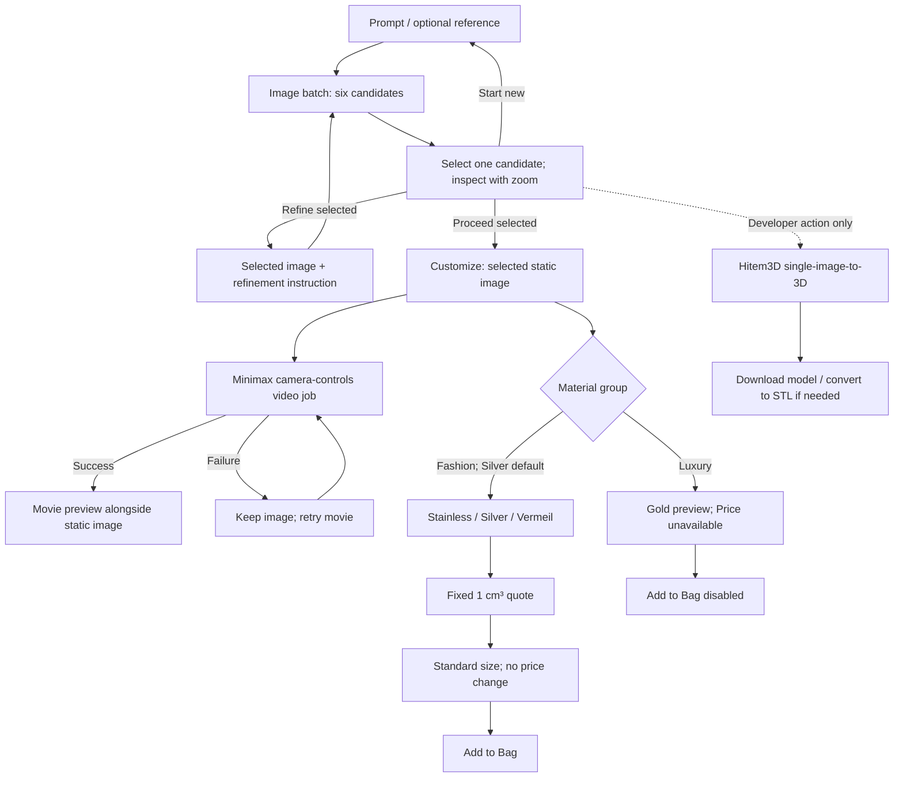

# Pipeline 3 — product specification and implementation handoff for Claude

Date: 2026-09-29

## 1. Read this first: protect the commercial Pipeline 2

This document is an implementation brief for a future Claude session. Preparing this brief does not create a repository, change application code, run generations, or deploy anything.

**Pipeline 2 is frozen and commercial. Build Pipeline 3 in a NEW, INDEPENDENT repository. Do not implement Pipeline 3 in Pipeline 2, on a branch in its checkout, or in a worktree sharing its repository.**

Existing repository, for read-only reference:

`C:\Users\yakir.tubul\Git\XjetJewelryBuilder`

Suggested new repository location, subject to availability:

`C:\Users\yakir.tubul\Git\XjetJewelryBuilderPipeline3`

The suggested name is an implementation default, not a user-selected mandatory name. If the destination already exists, inspect it before using it; never overwrite unrelated work.

Mandatory isolation rules for Claude:

1. Read the old repository only to understand and selectively reuse relevant source. Do not edit, format, reset, clean, checkout, install into, or otherwise mutate it. Do not initialize its missing submodules.
2. Create an independent Git repository for Pipeline 3. Do not inherit the old repository's Git metadata, hooks, remote configuration, deployment scripts as active automation, or production connection settings.
3. Any reused files must be independent copies in the new repository. Do not use symlinks, shared writable folders, or runtime imports pointing into Pipeline 2.
4. Use separate configuration, database files, generated assets, logs, caches, environments, and development ports. No writes to Pipeline 2's data or assets.
5. Do not copy secrets, private key files, tokens, customer records, generated customer designs, order information, or operational logs. Provide environment-variable configuration and a placeholder-only example file.
6. Do not alter Pipeline 2's domain, proxy configuration, services, scheduled jobs, or production deployment. No publishing or cutover is included in this brief.
7. Read-only source inspection is allowed. Running the old backend is not appropriate: startup and requests may write databases, logs, assets, or config.
8. Keep this specification and subsequent implementation documentation inside the new repository when implementation begins. Do not save further planning changes into the frozen repository.
9. Record the source revision used for reference and verify at the end that Pipeline 2's existing working-tree changes have not been altered. Existing untracked work belongs to the user and must be preserved.

The Pipeline 2 review used revision `1e871734bb9ac0f824bdb8950d62fbf6a35083bb`. Its companion document is `PIPELINE_2_FLOW.md`, supplied alongside this brief; a copy also exists in the old repository. That document describes existing behavior, not requirements to reproduce every old feature.

## 2. Objective and scope

Build a faster, leaner, more robust ring-design experience called Pipeline 3. Keep the familiar design → customize → bag/order progression where applicable, but replace the expensive geometry-dependent customer path with image selection, a generated video, and fixed-volume fashion pricing.

The primary customer experience must not depend on generating or measuring a 3D mesh.

This brief distinguishes:

- **Confirmed requirements:** explicitly agreed with the product owner, listed in section 3.
- **Implementation recommendations:** proposed defaults and engineering guidance. They must not be represented as additional product decisions already approved.
- **Verification items:** provider contracts and inherited behavior that must be checked before implementation can claim support.

Current deliverable: this Markdown handoff only. The sections instructing Claude to build and test apply when the user starts the implementation task.

## 3. Confirmed product requirements

| Area | Agreed behavior |
|---|---|
| Repository | New independent repository; no changes to commercial Pipeline 2 |
| Initial generation | One prompt produces six different image options from that same prompt |
| Selection | User selects one image; a clear rectangular border identifies the selected image |
| Zoom | User can enlarge/zoom an image to inspect it |
| Design actions | Refine the selected image; proceed with the selected image; start a new design |
| Refinement | Refining the selected image produces six new image variations |
| Customize image | Reuse the selected image as the static preview |
| Customize video | Generate a movie from the selected image using `minimax/h3-max/camera-controls` |
| Default material | Silver |
| Fashion jewelry group | Stainless Steel, Silver, Vermeil; selecting the group reveals its options |
| Luxury group | Gold options; selecting the group reveals its options |
| Fashion pricing | Calculate using a fixed volume of **1 cc = 1 cm³**, with the selected material |
| Luxury pricing | Unavailable for now; display **“Price unavailable”** |
| Luxury purchasing | Luxury can be previewed, but Add to Bag is disabled |
| Ring size | User selects a standard ring size; size does not change the fixed-volume price |
| Visual Hull | Removed |
| Automatic measurement | Removed |
| 3D/STL | Developer-only generation using `hitem3d/hi3d/v3.0/image-to-3d`, with STL conversion if needed |

Six images means six separately identified candidate outputs, not a single image containing a six-panel collage. The shared prompt should remain the same across candidates; the outputs should be distinct variations while retaining the requested design intent.

The image generation provider was not changed by the product owner. Continuing to use the existing Nano Banana generation/edit adapters is a recommendation, not a newly confirmed model choice. Verify the supported way to request six outputs before selecting the batching strategy.

## 4. Proposed customer journey

### 4.1 Enter Design

Preserve the recognizable ring-design experience and relevant registration/saved-design behavior where practical. Scope remains rings unless the user explicitly expands it. Do not introduce additional jewelry categories simply because materials are grouped as Fashion and Luxury.

### 4.2 Generate six candidates

1. User enters a design prompt, with existing reference-image input support if retained.
2. Validate input using the retained prompt policy where applicable.
3. Submit one logical generation batch requesting six candidate images from the same effective prompt.
4. Show six image slots with meaningful loading/error states.
5. Display each available candidate as a separate image.
6. User selects one candidate. The selected card has a visible rectangular border, and the selection remains clear after zoom closes.
7. User may zoom the selected candidate for inspection.
8. Keep the three actions visible: **Refine selected**, **Proceed with selected**, **Start new**.

Recommended interaction defaults: no automatic selection; disable Refine and Proceed until a ready image is selected; provide an explicit zoom control so enlarging an image does not ambiguously toggle selection. A responsive desktop grid can be three columns by two rows; use fewer columns on smaller screens. These layout details are recommendations, not fixed product requirements.

### 4.3 Refine the selected image

1. User selects a ready candidate and enters a refinement instruction.
2. Use that exact image as the source reference for all six refinement outputs.
3. Produce six new variations, all based on the same selected parent and refinement instruction.
4. Show the new candidate batch and let the user choose again.
5. Preserve parent/batch relationships so outputs remain traceable and late results cannot replace a different design's candidates.

Do not refine all six previous images independently. Do not return a single refined image. Do not silently fall back to text-only generation if the selected source image cannot be loaded; report a recoverable reference-image error instead.

Recommended presentation: retain the prior successful batch until the new one is ready, with visible refinement progress. The exact history navigation treatment can be decided during implementation.

### 4.4 Proceed to Customize

1. Capture the selected candidate ID and image URL as the authoritative input for this customization revision.
2. Open Customize and show the selected static image immediately.
3. Generate the movie from this same selected image using `minimax/h3-max/camera-controls`.
4. Show a video loading state while retaining the static preview and material/size controls.
5. When the movie is ready, make both static image and movie available to the user.

Do not generate six movies while the user is choosing images. Do not regenerate an image just to provide Customize's static preview. Do not wait for Visual Hull, measurement, cardinal extraction, Hitem3D, or STL generation to open Customize.

Recommended robust behavior: a video failure leaves the image and customization controls usable, with a retry for that video only. Video readiness should not determine whether a valid fashion price can be calculated. Whether video completion must gate purchasing is not an explicitly confirmed requirement; prefer keeping it outside the pricing path and document the decision.

### 4.5 Material groups and default

Initially select **Fashion jewelry → Silver**.

| Group | Customer label | Reuse candidate for internal mapping | Purchase state |
|---|---|---|---|
| Fashion jewelry | Stainless Steel | Existing Stainless Steel / SS316L mapping | Available with fixed-volume price |
| Fashion jewelry | Silver | Existing Sterling Silver 925 mapping | Available with fixed-volume price |
| Fashion jewelry | Vermeil | Existing 14K Gold Vermeil mapping | Available with fixed-volume price |
| Luxury | Gold options | Existing supported gold variants, subject to catalog confirmation | Preview only; price unavailable; cannot add to bag |

The Silver and Vermeil internal mappings above are recommended continuity defaults. The exact Luxury list beyond Gold has not been specified: do not invent platinum, gemstones, or additional purchasable luxury options.

Selecting a group reveals its material options. Material switching must not leave a previous fashion price or enabled purchasing state visible when Luxury is selected. Returning to Fashion should restore/recalculate that material's price.

Material preview may reuse existing visual tinting as an implementation default. The user has not requested paid image/video regeneration on material changes. Do not claim that cosmetic recoloring changes a manufacturing mesh or accurately simulates every metal finish.

### 4.6 Ring size and bag

Keep standard ring-size selection. Save the selected size as an order/design choice, without measuring a bore and without changing price by size.

For Fashion, enable Add to Bag when required selections and a valid fashion quote are available. For Luxury, always disable Add to Bag and show “Price unavailable.” Enforce this on the server as well if a server-side cart/order route is implemented.

If quantities/per-piece sizes are retained, all sizes for the same fashion material use the same fixed-volume unit price. Quantity changes the line total, not the assumed unit volume.

Starting a new design must clear active selection and old generation/customization associations. Recommended behavior: preserve saved designs and existing bag contents; do not interpret “Start new” as deletion of saved work.

## 5. Pipeline diagram



There is no Visual Hull, frame-derived cardinal reconstruction, ring measurement, or mesh-dependent price stage in this graph.

## 6. Pricing specification and unresolved formula detail

### Confirmed rules

- Every fashion item uses assumed volume `1.0 cm³` per unit.
- Selected fashion material determines the relevant cost/density/margin mapping.
- Ring size does not alter the quote.
- Image content, video, mesh volume, measured dimensions, or STL generation must not be required for pricing.
- Luxury has no numeric price and is not purchasable. Do not represent an unavailable price as zero or fall back to an old catalog price.

### Important implementation distinction

The current Pipeline 2 CPP calculator takes bounding-box dimensions as well as volume: tray packing and process cost depend on dimensions. **Fixing volume to 1 cm³ does not define those dimensions.** The user has confirmed fixed volume, not a replacement manufacturing-cost formula.

Claude must make this limitation explicit rather than inventing a cube, guessed ring dimensions, or a material-only formula and presenting it as approved.

Recommended approach:

1. Put fashion pricing behind one small, server-authoritative pricing service.
2. Use a versioned, configurable price profile per fashion material with the fixed volume clearly recorded.
3. Reuse the existing CPP formula only if the reference dimensions and process assumptions are deliberately configured and documented.
4. If using precomputed prices, record how they were obtained and their effective configuration version.
5. Build the UI/API contracts and tests independently of the final numeric price profile. Before asserting production-ready prices, obtain the missing reference-dimension or fixed-price-table decision.

This is a narrow pricing verification item, not a reason to redesign the agreed flow or repeatedly ask about the six-image/material/size decisions.

Suggested quote shape:

```json
{
  "material_id": "silver",
  "material_group": "fashion",
  "pricing_status": "available",
  "assumed_volume_cm3": 1.0,
  "currency": "USD",
  "unit_price": 0,
  "pricing_version": "configured-profile-version"
}
```

The `unit_price` zero above is a schema placeholder, not an approved price; production validation must reject missing/placeholder pricing. Currency USD is a continuity recommendation from Pipeline 2. For Luxury return `pricing_status=unavailable` and `unit_price=null`.

Optional displayed weight may be estimated as `1.0 × density_g_per_cm3`; label it as an estimate based on assumed volume. Do not label it a measured weight. Vermeil plating was not costed by the old calculator; account for this explicitly in any approved profile rather than silently implying it is included.

## 7. Provider integration requirements

### 7.1 Image batches

Recommended starting point: reuse independently copied Nano Banana Pro text-to-image and image-edit adapter logic, subject to checking the current provider contract.

- Preserve the effective prompt across all six slots.
- For refinement, preserve both the source candidate identity and identical refinement instruction across the six outputs.
- Prefer a provider-supported batch operation where it meets these semantics; otherwise use bounded concurrent requests.
- Verify output count, accepted request fields, provider limits, seed behavior, and actual cost implications. Do not assume a `num_images=6` parameter exists.
- Store each candidate separately, with its own state and artifact URL.
- Retrying a failed slot must not silently regenerate all successful slots.
- Use request/slot identity to avoid duplicates from repeated clicks or polling retries.
- Distinct outputs are a product goal, not a guarantee supplied merely by sending identical prompts. Detect exact duplicate outputs where practical and use a bounded retry policy rather than an unbounded generation loop.
- Six outputs can cost more and take longer than one. Do not claim performance gains until measured.

### 7.2 Customize movie

Required model identifier: `minimax/h3-max/camera-controls`.

Before implementation, inspect the provider's official current schema. Verify the endpoint name, input-image field, camera-control syntax, supported duration/resolution/aspect ratios, job states, result structure, and timeout/error behavior.

The product owner selected the model identifier, not a particular camera-motion payload. Do not carry forward Veo's 8-second/720-degree instructions or its resolution/seed/negative-prompt parameters as if they were Minimax-compatible. Choose and document supported product-preview motion settings. If the exact endpoint is unavailable or named differently, report that discrepancy rather than silently switching models.

Generate from the selected image only. Persist the movie and its association to the selected candidate. Reuse a ready movie when returning to the same candidate/configuration. Retry only the movie when it fails. Prefer a straightforward video player initially; retaining JPEG scrub frames is optional and should be justified by a concrete UX benefit.

### 7.3 Developer-only Hitem3D/STL

Required endpoint: `hitem3d/hi3d/v3.0/image-to-3d`.

- Input is the selected single image, not extracted cardinal views.
- No automatic customer-flow invocation, including on Customize or Add to Bag.
- Do not use the multi-view endpoint for this feature.
- Keep it behind a real developer/admin access boundary, not only a hidden keyboard shortcut or CSS-hidden button.
- Verify current model parameters and available export formats. Existing P2 defaults are a reference, not a guaranteed current provider contract.
- If the provider directly supplies a supported STL, preserve it; otherwise convert an appropriate returned mesh to STL in a separate developer operation.
- Preserve selected candidate and generation settings as artifact provenance.
- Download/conversion failure must not break the customer's image, movie, quote, or bag.
- Do not describe this model as measured, sized to the user's ring size, watertight, production-approved, or ready to manufacture unless separate validation actually establishes that.

## 8. Remove from the customer pipeline

Do not copy these into Pipeline 3 as mandatory dependencies or dormant calls in the normal flow:

- `Pipeline2.run_visual_hull`, Visual Hull reconstruction jobs, and hull STL caching.
- `_runVisualHullPipeline`, `_measure_bore_from_video`, ring rescaling/measurement tasks.
- `ringMeasuredDiameter`, `ringBaselineGeo`, geometry-dependent `analysisReady`, and the `open_ring` purchasing fallback.
- Cardinal/quadrant extraction for reconstruction or pricing.
- Multi-view Hitem3D generation in the customer journey.
- Geometry-based `/api/analyze-part` as the source of customer pricing.
- Size-driven `sf³` volume/pricing calculations.
- Veo-specific processing as the active movie-generation path.
- Generic fallback catalog prices shown as if they were current calculated quotes.

Removing measurement is separate from deciding whether to retain ring-image validation. The old classifier imports VisualHull modules, so blindly copying it recreates the removed dependency. If retained, make image validation an explicitly independent component; otherwise document the validation change. Do not initialize the old repository's submodule to obtain it.

## 9. Recommended lean technical design

These are implementation recommendations, not a mandate to introduce a large platform or a specific framework.

- Prefer a small modular application and familiar reusable code over copying the entire P2 application and hiding its old stages.
- Keep provider adapters, job execution, persistence, pricing, and UI state separate enough to test independently.
- Retain a lightweight database such as SQLite if appropriate for the deployment. Unlike P2, persist batch/job state and artifact associations so refresh/restart has an explicit recovery path.
- A durable job record does not by itself resume remote work. Persist provider task identifiers where supported; reconcile on restart, or mark interrupted jobs as recoverable failures. Never poll nonexistent memory-only jobs indefinitely.
- Use bounded concurrency for six-image generation; isolate slow provider work from request handling.
- Use one consistent polling/status contract with bounded retries and clear terminal states.
- Persist downloaded artifacts atomically and validate successful responses before declaring an asset ready.
- Associate every asynchronous result with the design revision/candidate that requested it. Late results must not overwrite the currently selected design.
- Include generation/configuration versions in movie/model cache keys.
- Make server-side validation responsible for material availability and quote integrity. Browser-only disabled buttons are not a purchasing policy.
- Handle filesystem paths by resolving them within the new repository's asset root. Never trust arbitrary user-supplied static paths.
- Avoid quota/accounting surprises: preserve the concept of user access/usage if retained, but do not silently reinterpret one P2 video credit as six image credits. Document the proposed batch/refinement charging policy separately before presenting it as approved.

### Suggested persisted objects

| Object | Minimum useful fields |
|---|---|
| Design | ID, owner, prompt/context, selected candidate ID, timestamps |
| Generation batch | ID, design ID, type initial/refine, parent candidate ID, effective prompt/instruction, desired count six, config version, status |
| Candidate | ID, batch ID, slot index, image URL, status/error, provider request reference |
| Customization | ID/revision, selected candidate ID, material group/material, standard ring size, quote reference |
| Movie job/artifact | ID, candidate/customization association, model/config version, provider task ID, status/error, movie URL |
| Developer mesh | ID, candidate ID, endpoint/settings, job status, original mesh URL, optional STL URL |
| Fashion quote | material, assumed 1 cm³ volume, unit price/currency, pricing version, availability |
| Bag line, if retained | design/candidate/customization IDs, material, size, quantity, authoritative quote snapshot/reference |

Suggested statuses: batch `queued/generating/complete/partial/failed`; candidate `pending/generating/ready/failed`; movie/mesh `queued/running/ready/failed/interrupted`. These are proposals; choose consistent names and document actual contracts.

### Suggested API responsibilities

Exact endpoint names are Claude's implementation choice in the new repository:

- Create initial six-image batch.
- Create six-image refinement batch from a selected candidate.
- Read batch/candidate status and retry failed slots.
- Save selection/customization.
- Start/read/retry the selected-image movie job.
- Read material catalog and availability; obtain a fixed-volume fashion quote.
- List/open saved designs if retained.
- Developer-authenticated single-image mesh generation and STL download/conversion.

No customer measurement, hull, or four-view endpoints are necessary.

## 10. Failure behavior and recovery

| Situation | Expected behavior |
|---|---|
| One image slot fails | Preserve successful images, show failed slot(s), offer bounded retry of missing outputs |
| Partial batch | Do not label fewer than six as a complete batch; recommended default allows selecting a ready image while remaining slots finish/retry |
| Entire batch fails | Preserve prompt/reference; offer retry with a clear error |
| User refines/switches designs while work is pending | Keep results attached to their original batch; never overwrite the active selection with stale work |
| Reference image unavailable during refinement | Recoverable error; no silent text-only replacement |
| Repeated Proceed clicks | Reuse/deduplicate the same candidate/configuration movie request |
| Movie unavailable | Keep selected static image visible; offer movie-only retry |
| Material becomes Luxury | Clear numeric price, show unavailable state, disable Add to Bag |
| Fashion profile missing or invalid | Show price unavailable; do not fall back to zero, a luxury price, or an old unrelated estimate |
| Page reload | Recover saved selection and known job states where persisted; do not automatically repeat paid requests |
| Server restart | Reconcile persisted provider jobs or report interrupted/retryable status explicitly |
| Transient network/poll failure | Retry reading the same job within bounded limits; do not create a new generation job |
| Developer mesh failure | Report within developer tools; leave customer flow intact |

Recommended partial-batch handling is explicitly a default, not an additional product-owner decision. The successful batch contract remains six images.

## 11. Reuse map from Pipeline 2

Reference paths below are relative to the old repository and are read-only. Copy selected source into the new repository only after removing P2 dependencies and auditing imports/configuration.

| Old source | Useful reference | Required adaptation |
|---|---|---|
| `app/static/js/app-p2.js` | Design/customize interactions, material choices, size selection, saved-design concepts | Replace monolithic stage orchestration, six-candidate state, remove measurement and legacy routes |
| `app/templates/index-p2.html` | Visual language, screen structure, material/size controls | Six-image selection UI, Fashion/Luxury grouping, unavailable-price state |
| `app/static/js/api-client.js` | Structured errors and resilient polling | New consistent batch/job API; persisted-job recovery |
| `app/PipelineBase.py` image functions | Nano Banana payloads, uploads/downloads | Extract independent adapters; avoid importing the entire module with old dependencies |
| `app/ai_config.py` and prompt text files | Editable generation prompts/parameters | New repository-owned, versioned config; no production secrets |
| `app/project_store.py` | Saved-design persistence pattern | New database and batch/candidate/artifact relationships |
| `app/token_store.py`, registration/mail modules | Access and registration patterns if retained | New data/config and explicit usage policy; do not email real users during tests |
| `app/static/js/metal-map.js`, `xjet-calc.js`, CPP constants | Material mapping and price/cost reference | Approved fixed-volume profile; eliminate runtime mesh dependency and inconsistent calculation paths |
| `app/static/js/app-backend.js` | Optional mesh viewing | Developer tools only as needed; no price callback from measured mesh |
| `RunHitem3DTask` | fal.ai single-image model workflow | Single selected-image input, real developer auth, consistent job status, isolated artifacts |

Do not copy the entire runtime directory, databases, model assets, virtual environment, `.git`, logs, key files, or generated job JSON. Do not assume old comments are accurate; use `PIPELINE_2_FLOW.md` and executable code together.

## 12. Checkout and operations boundary

The old P2 code reviewed here has a browser-only coupon/reservation flow. It does not submit an order to a server, capture payment, send an order email, or dispatch manufacturing. The owner's statement that Pipeline 2 is commercial does not establish where any operations outside that code occur.

Do not copy the old reservation screen and describe Pipeline 3 as supporting real checkout. Preserve the bag/order UI only to the agreed scope and explicitly document whether it remains a prototype reservation or integrates with a real system.

This specification does not authorize inventing or deploying a payment processor, order-management system, manufacturing integration, or migration of commercial customers. Those integration details require a separate identified contract. Existing external commercial operations, if any, remain untouched.

## 13. Acceptance criteria

### Isolation

- Pipeline 3 has its own repository and runtime data paths.
- Pipeline 2's tracked and pre-existing untracked files are unchanged.
- Pipeline 3 does not import code/assets/configuration from the old checkout at runtime.
- No production keys/customer databases/assets are copied or modified.
- No deployment or domain changes have been performed.

### Six-image design and refinement

- A successful initial batch displays exactly six distinct candidate records/images from the same effective prompt.
- Selecting a candidate visibly marks its rectangular card; zoom preserves selection.
- Refine and Proceed operate on the selected candidate, not the first image or last completed request.
- Refining creates six new variations from the selected image and refinement instruction.
- Partial/failed outputs are honest and recoverable without discarding successful slots.
- Starting new and receiving late job results do not mix different designs.

### Customize and video

- Proceed shows the selected static image immediately.
- The Minimax request uses that same selected image and the verified required endpoint.
- Image and movie remain available once generation completes.
- Retrying video does not regenerate the six-image batch or duplicate a still-running movie job.
- No Visual Hull, measurement, or automatic Hitem3D call occurs on this path.

### Materials, pricing, and size

- Initial material is Fashion → Silver.
- Fashion reveals Stainless Steel, Silver, and Vermeil; Luxury reveals the configured gold options.
- Fashion quotes explicitly use 1 cm³ per item.
- Changing standard ring size does not change unit price, and the chosen size is preserved.
- Luxury shows “Price unavailable,” with Add to Bag disabled and no stale fashion price.
- Missing fashion pricing cannot unlock purchasing through a fallback price.
- Any retained cart/order API enforces the same availability/quote rules as the UI.

### Developer mesh and robustness

- Only authorized developer/admin users can request the Hitem3D single-image workflow.
- Input is the selected image; no four-view generation is required.
- STL is downloadable directly or after verified conversion when available.
- Mesh work does not block customer design/customization/pricing.
- Refresh, transient failures, and interrupted jobs have explicit recovery behavior without automatic duplicate paid submissions.

### Verification evidence

Use mocked provider calls for routine tests. Test batch/refinement lineage, partial failures, deduplication, selection/zoom behavior, material group switching, fixed-volume/size-invariant pricing, unavailable-price enforcement, developer authorization, and restart/reload recovery. Record which provider calls were actually exercised versus mocked.

Live provider validation should use the new repository's configured test credentials and an explicit test budget. Do not treat UI simulation as proof of live model compatibility, generated-geometry quality, or production checkout.

## 14. Suggested implementation sequence for Claude

1. Read this specification and the companion P2 flow review. Record any narrow provider/pricing uncertainties without reopening confirmed product decisions.
2. Inspect the old source read-only; establish a safe independent destination and repository.
3. Add new-repository setup/configuration/docs and isolated storage. Implement provider adapters against verified schemas with mocks first.
4. Implement six-image batches, persisted candidate state, selection, zoom, and six-output refinement.
5. Implement Customize with immediate static preview, selected-image Minimax video, and targeted retry/reuse.
6. Implement grouped material catalog, Silver default, fixed-volume pricing boundary, Luxury unavailability, and size selection. Resolve numeric pricing-profile assumptions before claiming real prices.
7. Add isolated saved-design/access behavior as needed, without importing production data or silently changing quota semantics.
8. Add optional developer-only Hitem3D and STL handling.
9. Validate the acceptance criteria and document any remaining checkout/provider/pricing limitations.
10. Report the new repository path, implemented flows, test evidence, known limitations, and confirmation that Pipeline 2 was left untouched. Do not deploy automatically.

## 15. What Claude should deliver when implementation is authorized

- A separate Pipeline 3 repository with working source and setup instructions.
- This specification preserved as a planning baseline, plus documentation of actual implemented contracts and any approved changes.
- A placeholder-only configuration example and separate local data/asset directories.
- Focused tests and clear distinction between mocked and live-provider verification.
- A concise list of unresolved external dependencies or commercial integrations.
- No changes to Pipeline 2.

**Core instruction: build the new experience independently. Six images → selected-image refinement or Customize → static image plus Minimax movie → fixed 1 cm³ Fashion pricing / preview-only Luxury. No Visual Hull or measurement; Hitem3D/STL stays developer-only.**
